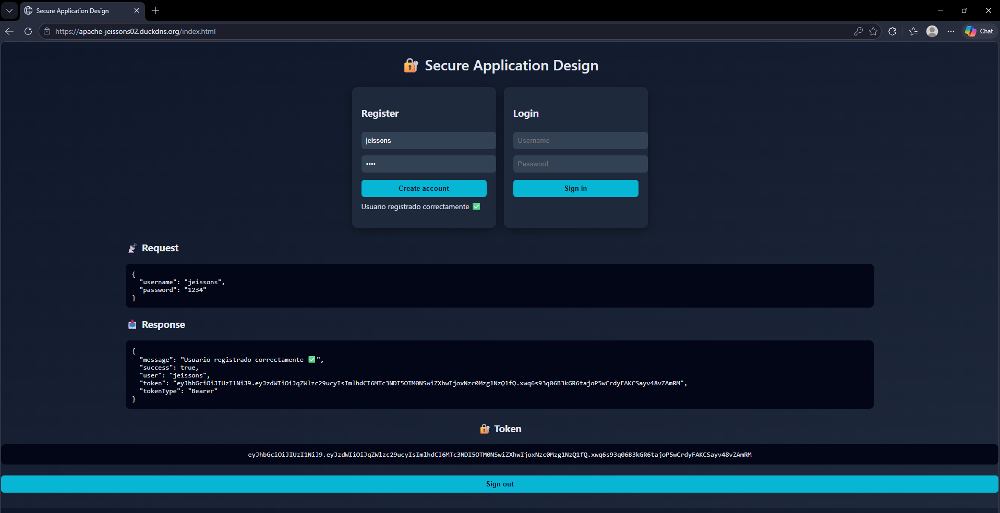
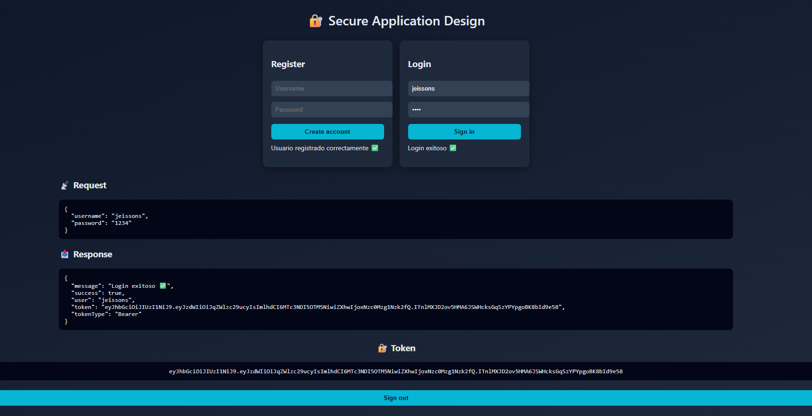
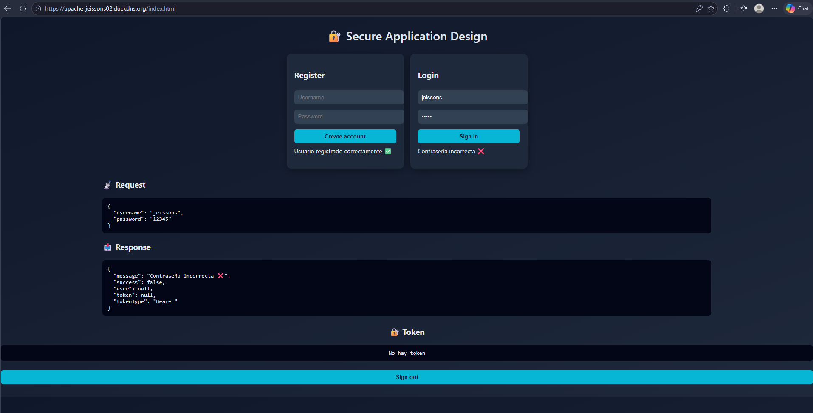
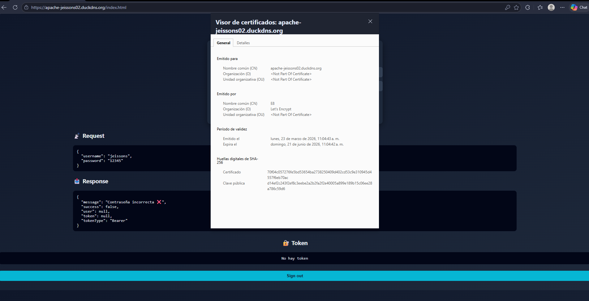
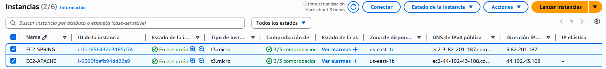
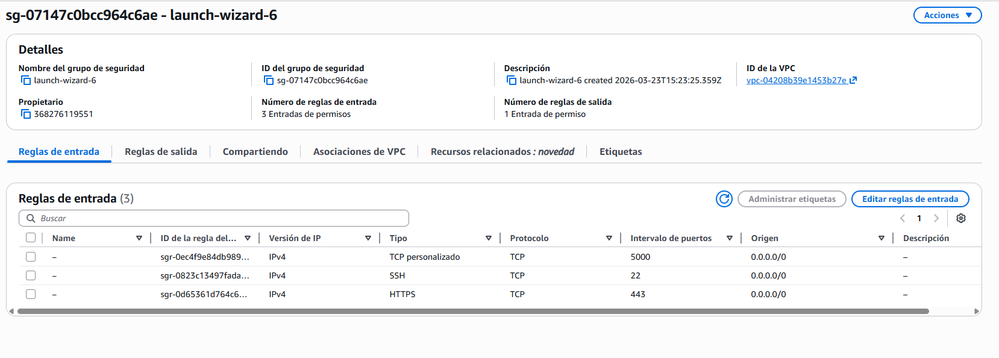
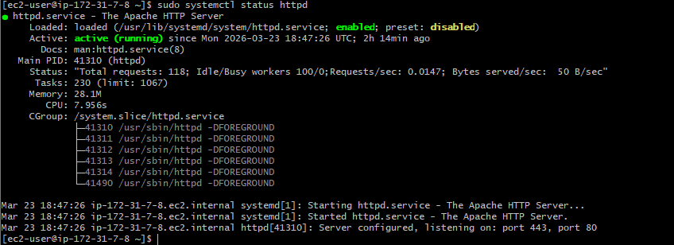
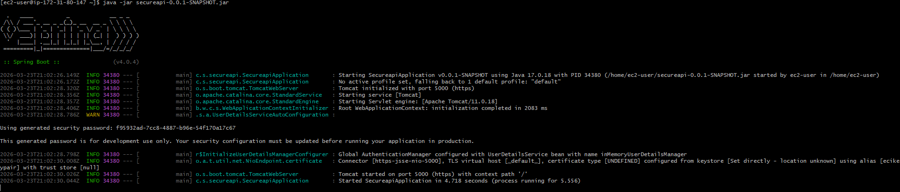

# 🔐 Secure Application Design on AWS with Apache & Spring Boot

[]
[]
[]
[]
[]
[]
[]
[]

Secure distributed web application deployed on AWS using Apache as a secure client server and Spring Boot as a REST API backend, implementing TLS encryption and JWT-based authentication.

------------------------------------------------------------------------


## 📌 Project Overview

This project implements a **secure distributed web application** deployed on AWS using a multi-server architecture.

The system is composed of two main components:

- An **Apache HTTP Server**, responsible for serving a static asynchronous HTML + JavaScript client over HTTPS.
- A **Spring Boot backend**, exposing RESTful APIs secured with TLS and JWT-based authentication.

The goal of this project is to demonstrate how modern secure applications are built using best practices in **software architecture, security, and cloud deployment**.

The application provides:

- 🔐 Secure communication using **TLS (HTTPS)** with Let's Encrypt certificates  
- 🌐 A **client-side application (HTML + JS)** served by Apache  
- ⚙️ A **REST API backend** built with Spring Boot  
- 🔑 Authentication system with **hashed passwords (BCrypt)**  
- 🪪 Token-based authentication using **JWT (JSON Web Tokens)**  
- 🔄 Communication between frontend and backend using **asynchronous requests (fetch API)**  
- ☁️ Deployment on **AWS EC2 instances (separate servers)**  
- 🔀 Reverse proxy configuration to connect Apache with the backend service  

This project reflects a real-world secure architecture where frontend and backend services are separated, encrypted, and deployed in a scalable cloud environment.

------------------------------------------------------------------------

🔥 Perfecto — esta es LA sección más importante del README, y la vamos a adaptar a TU arquitectura real (Apache + Spring + AWS + TLS + JWT).

✅ 🏗 Architecture (VERSIÓN CORRECTA PARA TU PROYECTO)

Reemplaza completamente lo que tienes por esto 👇

------------------------------------------------------------------------

## 🏗 Architecture

The system follows a **distributed multi-tier architecture**, where frontend and backend services are deployed on separate AWS EC2 instances and communicate securely through HTTPS.

### 🔁 Request Flow

Client Browser  
↓  
HTTPS Request  
↓  
Apache Server (Frontend - EC2 #1)  
↓  
Reverse Proxy (/api)  
↓  
Spring Boot Backend (EC2 #2)  
↓  
Service Layer  
↓  
Repository Layer (In-memory storage)  
↓  
Response (JSON with JWT)  
↓  
Apache → Client

---

### 🧩 Component Description

#### 🌐 Apache Server (Frontend)
- Serves the **HTML, CSS, and JavaScript client**.
- Configured with **TLS using Let's Encrypt certificates**.
- Handles all incoming HTTPS requests from the browser.
- Implements a **reverse proxy** to forward `/api` requests to the backend.
- Prevents direct exposure of the backend service.

---

#### 🔀 Reverse Proxy (Apache → Spring)
- Routes requests from `/api/*` to the backend server.
- Enables **secure and transparent communication** between client and backend.
- Avoids **mixed content issues** and centralizes access through a single domain.

---

#### ⚙️ Spring Boot Backend
- Provides **RESTful API endpoints** (`/login`, `/register`).
- Runs on a separate EC2 instance.
- Secured with **HTTPS (TLS)**.
- Implements business logic for authentication.

---

#### 🧠 Service Layer
- Contains the core application logic.
- Handles:
  - User registration
  - Login validation
  - Password hashing (BCrypt)
  - JWT token generation

---

#### 🗄 Repository Layer
- Simulates a database using an **in-memory data structure**.
- Stores user credentials securely (hashed passwords).
- Provides methods such as:
  - `findByUsername`
  - `save`
  - `exists`

---

#### 🔐 Security Layer
- Implements **password hashing using BCrypt**.
- Generates **JWT tokens** for authenticated users.
- Ensures stateless authentication for future requests.

---

#### 💻 Frontend (HTML + JavaScript)
- Asynchronous client using **Fetch API**.
- Sends login and registration requests to `/api`.
- Displays request/response data dynamically.
- Stores JWT tokens in **localStorage**.

---

### ⚡ Key Architectural Features

- **Distributed Architecture** → Frontend and backend deployed on separate servers.
- **Secure Communication (TLS)** → HTTPS enabled on both Apache and Spring.
- **Reverse Proxy Integration** → Centralized access through Apache.
- **JWT Authentication** → Stateless and scalable authentication mechanism.
- **Separation of Concerns** → Clear division between frontend, backend, and infrastructure.
- **Cloud Deployment (AWS EC2)** → Real-world hosting environment.

------------------------------------------------------------------------

## 🧠 Core Concepts Demonstrated

### 1️⃣ Secure HTTP Communication (TLS)

The application ensures secure communication using **HTTPS (TLS)** on both frontend and backend:

- Apache uses **Let’s Encrypt certificates** to serve the client securely.
- Spring Boot backend is also configured with **TLS encryption**.

This guarantees:
- Data confidentiality
- Data integrity
- Protection against man-in-the-middle attacks

---

### 2️⃣ Reverse Proxy Architecture

Apache acts as a **reverse proxy**, routing API requests to the backend:

```text
/api → Spring Boot backend
```
This provides:
- Centralized access point
- Backend isolation 
- Elimination of mixed content issues

### 3️⃣ RESTful API Design

The backend exposes REST endopints:

```bash
POST /api/register
POST /api/login
```
Each endpoint:
- Receives JSON requests
- Return structured JSON responses
- Follov stateless communication preinciples

### 4️⃣ Password Hashing with BCrypt

User passwords are never stored in plain text.

```java
String hashed = encoder.encode(password);
```

- Uses BCrypt hashing algorithm
- Protects against credential leaks
- Follows modern security standards

### 5️⃣ JWT-based Authentication

Authentication is implemented using JSON Web Tokens (JWT):

```java
String token = generateToken(username);
```

The token:
- Encodes user identity
- Is signed securely
- Has expiration time
- Is returned to the client after login/register

### 6️⃣ Stateless Authentication

The system follows a stateless authentication model:
- No session is stored on the server
- Each request can include a token
- Improves scalability and performance

### 7️⃣ Layered Backend Architecture

The backend is structured using best practices:

- Controller Layer → Handles HTTP requests
- Service Layer → Contains business logic
- Repository Layer → Manages data storage
- DTO Layer → Defines request/response structure


### 8️⃣ Asynchronous Frontend Communication

The frontend uses the Fetch API:
```javascript
fetch("/api/login", {
    method: "POST",
    body: JSON.stringify(data)
});
```

- Sends asynchronous HTTP requests
- Processes JSON responses dynamically
- Improves user experience

### 9️⃣ Cloud Deployment on AWS EC2

The application is deployed on two EC2 instances:

- Apache Server (Frontend)
- Spring Boot Server (Backend)

This demonstrates:

- Real-world distributed deployment
- Infrastructure separation
- Cloud-based scalability


------------------------------------------------------------------------

## 📁 Project Structure

The project follows a **modular and clean structure**, separating frontend and backend components:

    secureapi/
    ├── apache-client/ # Frontend (Apache Server)
    │ ├── index.html # Main UI
    │ ├── css/
    │ │ └── style.css # Styles
    │ └── js/
    │ ├── app.js # Application logic (fetch, login, register)
    │ └── config.js # API configuration
    │
    ├── src/
    │ └── main/
    │ └── java/
    │ └── com/secureapi/secureapi/
    │ ├── controller/ # REST Controllers
    │ ├── service/ # Business logic
    │ ├── repository/ # Data layer
    │ ├── model/ # Domain models
    │ ├── dto/ # Request/Response objects
    │
    ├── images/ # Screenshots and deployment evidence
    ├── pom.xml # Maven dependencies and build config
    ├── .gitignore # Ignored files (keys, builds, etc.)
    ├── .gitattributes
    └── README.md # Project documentation

------------------------------------------------------------------------


## 📸 Deployment Evidence



Successful user registration through the frontend, demonstrating communication between Apache (client) and Spring Boot backend with JWT token generation.

---



Successful authentication with valid credentials, returning a JWT token and confirming secure communication via HTTPS.

---



Failed login attempt with invalid credentials, demonstrating proper validation and error handling in the backend.

---



Secure HTTPS connection enabled using Let's Encrypt certificates on the Apache server.

---



Two EC2 instances deployed: one for Apache (frontend) and one for Spring Boot (backend).

---



AWS Security Groups configured to allow secure traffic (ports 80, 443, and backend communication).

---



Apache server running and serving the frontend application over HTTPS.

---



Spring Boot backend running with TLS enabled, handling API requests securely.

------------------------------------------------------------------------

## 📈 Learning Outcomes

Through this project, the following concepts and skills were developed:

- Understanding of **secure web application architecture** using a distributed multi-server approach.
- Implementation of **HTTPS (TLS)** using Let's Encrypt certificates for secure client-server communication.
- Configuration of a **reverse proxy with Apache**, enabling secure routing between frontend and backend services.
- Development of a **RESTful API using Spring Boot**, following best practices in backend design.
- Implementation of **secure authentication mechanisms** using:
  - Password hashing with **BCrypt**
  - Token-based authentication with **JWT (JSON Web Tokens)**
- Design of a **layered backend architecture** (controller, service, repository, DTO).
- Integration of an **asynchronous frontend (HTML + JavaScript)** using the Fetch API.
- Deployment of a distributed system on **AWS EC2 instances**, separating frontend and backend services.
- Configuration of **AWS Security Groups** to control and secure network access.
- Understanding of **stateless authentication** and its advantages for scalability.
- Debugging and troubleshooting of **real-world issues**, such as:
  - HTTPS configuration
  - Reverse proxy routing
  - Mixed content errors
- Application of **best practices in security, deployment, and software architecture**.

This project provides a solid foundation in building and deploying **secure, scalable, and cloud-based web applications**, closely aligned with real-world industry practices.

------------------------------------------------------------------------

## 👨‍💻 Author

[](https://github.com/JeissonS02)